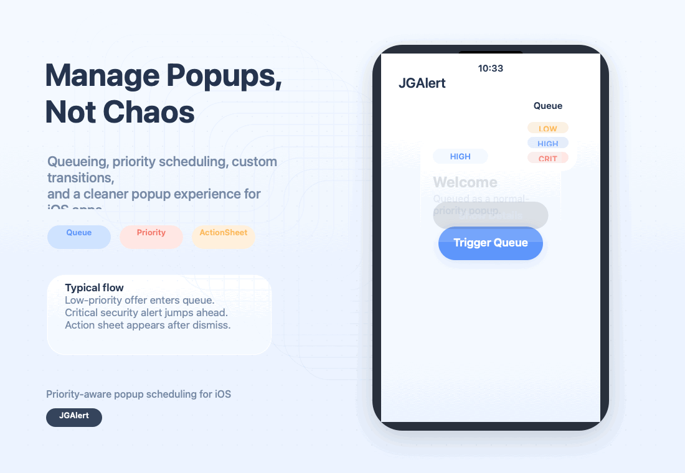

# JGAlert

An iOS alert scheduler and popup queue manager for apps that have too many popups.

中文简介：`JGAlert` 主要解决 App 里多个弹框同时出现时的冲突问题，支持弹窗队列、优先级调度、自定义动画和 `Alert` / `ActionSheet` 统一管理。

<p align="center">
  
</p>

[](http://cocoapods.org/pods/JGAlert)
[](http://cocoapods.org/pods/JGAlert)
[](http://cocoapods.org/pods/JGAlert)
[](https://www.swift.org/package-manager/)
[]()

## Why JGAlert

Many iOS apps do not have a popup UI problem. They have a popup scheduling problem.

Login rewards, upgrade prompts, privacy reminders, onboarding flows, risk warnings, marketing modals, and rating requests often compete for the screen at the same time. `JGAlert` helps you present them in a controlled way instead of letting them fight each other.

## Features

- Queue multiple alerts and sheets instead of presenting them at the same time
- Prioritize important dialogs with `low`, `normal`, `high`, and `critical` levels
- Support both custom alert views and action sheets
- Add custom transition animations
- Support background tap dismiss, auto dismiss, and drag-to-dismiss
- Work with both Swift and Objective-C projects
- Better window handling for iOS 13+ multi-scene apps

## Good Fit For

- Apps with many business popups
- Growth or campaign-heavy apps
- Apps that need popup priority management
- Teams that want to replace scattered `present(...)` calls with a single popup entry

## Installation

### CocoaPods

```ruby
pod "JGAlert"
```

### Swift Package Manager

In Xcode, add this repository as a package dependency:

```swift
.package(url: "https://github.com/JanyGee/JGAlert.git", from: "1.0.3")
```

Then add `JGAlert` to your target dependencies.

## Quick Start

```swift
import JGAlert

let alertView = MyAlertView(frame: CGRect(x: 0, y: 0, width: 280, height: 220))

let config = JGAlertConfig()
config.alertView = alertView
config.alertLevel = .high
config.alertTransitionType = .custom
config.transitionAnimationClass = JGDownUpAnimation.self

JGAlert.alert(config: config) {
    print("cancel")
} comfirmBlock: {
    print("confirm")
} dismissBlock: {
    print("dismiss")
}
```

### ActionSheet Example

```swift
let alertView = ActionView(
    frame: CGRect(
        x: 0,
        y: 0,
        width: UIScreen.main.bounds.width,
        height: 320
    )
)

let config = JGAlertConfig()
config.alertView = alertView
config.alertStyle = .actionSheet
config.alertLevel = .normal

JGAlert.alert(config: config)
```

## Common Use Cases

- Show a forced risk reminder before a low-priority campaign popup
- Queue onboarding tips after privacy and permission dialogs
- Present a custom action sheet without rewriting transition code
- Auto-dismiss lightweight status popups while keeping critical alerts visible

## Core Configuration

- `alertStyle`: `.alert` or `.actionSheet`
- `alertLevel`: popup priority level
- `alertTransitionType`: built-in or custom animation
- `durationDismiss`: auto dismiss after a delay
- `backgoundTapDismissEnable`: dismiss by tapping the background
- `comfirmDismissEnable`: keep the popup open after confirm if needed

## Demo

This repository includes both demo projects:

- `JGAlertDemo-swift`
- `JGAlertDemo-obj`

## Author

Jany Gee, 1321899953@qq.com

## License

JGAlert is available under the MIT license. See the [LICENSE](LICENSE) file for more info.
